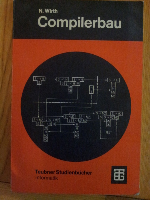

This is an unmaintained archive-repo.

Das erste Buch von Niklas Wirth, welches sich mit Compilerbau beschäftigte
war "Compilerbau" von 1977 und wurden im Rahmen der "Leitfäden der angewandten
Mathematik und Mechanik LAMM" herausgegeben.

In dem 117-Seiten Büchlein wurde die Erstellung eines EBNF-Parsers erläutert
und in Fortran implementiert.

Dies is die Übersetzung genau dieses EBNF-Parsers in C.

Und ich hab leider keine Ahnung mehr wie man das Teil baut.
